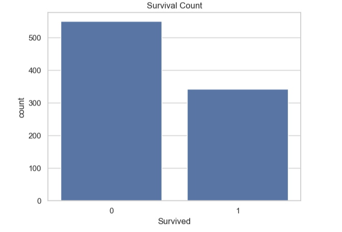
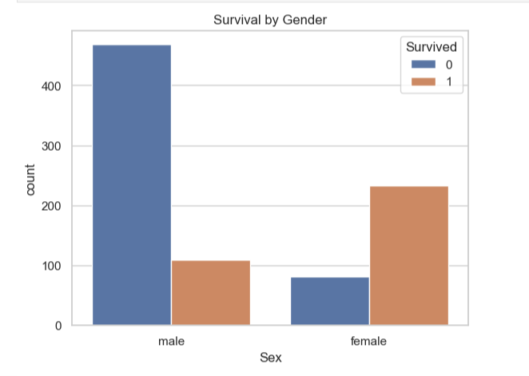
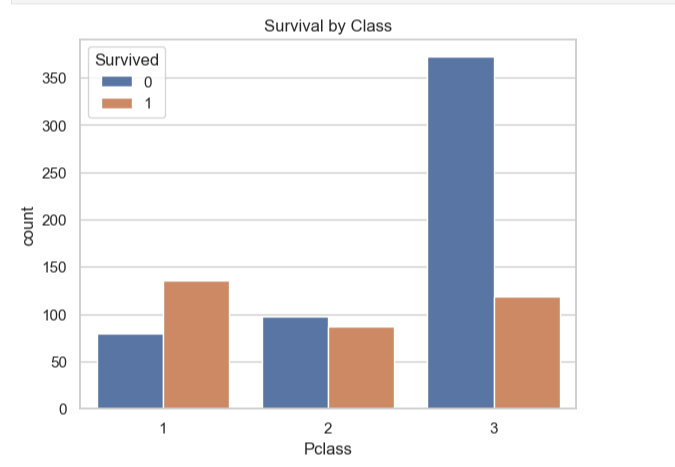
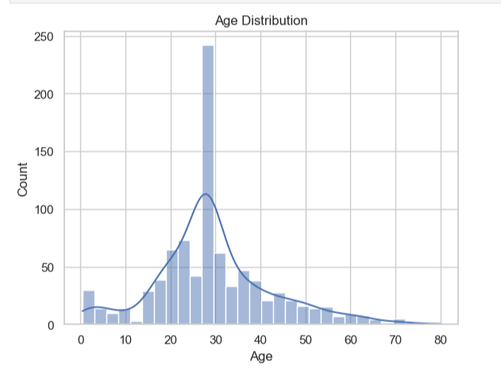
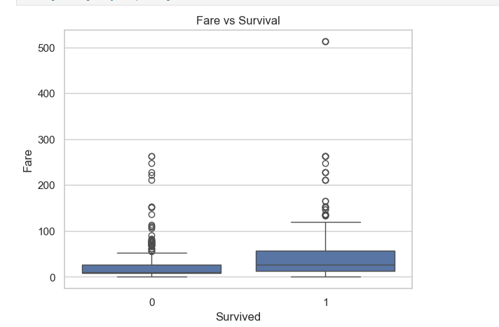
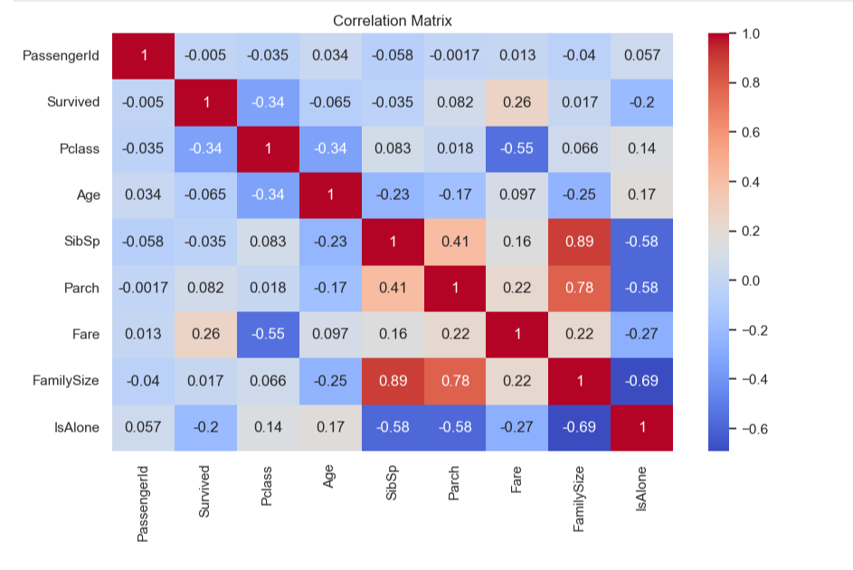

# Titanic Survival Analysis & Prediction

## Overview
This project performs **Exploratory Data Analysis (EDA)** and builds a **machine learning model** to predict passenger survival on the Titanic dataset.

It demonstrates an end-to-end workflow including **data cleaning, visualization, feature engineering, and model building** to extract meaningful insights and make predictions.

## Tech Stack
- Python  
- Pandas, NumPy  
- Matplotlib, Seaborn  
- Scikit-learn  
- Jupyter Notebook  

## Dataset
- File: `Titanic-Dataset.csv` (included in this repository)  
- Description: Contains passenger information such as age, gender, class, fare, and survival status  

### Target Variable
- `0` → Did Not Survive  
- `1` → Survived  

## Workflow
1. Data Loading  
2. Data Cleaning  
3. Exploratory Data Analysis (EDA)  
4. Feature Engineering  
5. Data Visualization  
6. Model Building  
7. Model Evaluation  

## Data Preprocessing
- Handled missing values in **Age** (median imputation) and **Embarked** (mode imputation)  
- Dropped **Cabin** column due to excessive missing values  
- Encoded categorical features for modeling  

## Feature Engineering
- **Title** → Extracted from passenger names to capture social status  
- **FamilySize** → Combined SibSp and Parch  
- **IsAlone** → Indicates whether a passenger traveled alone  
- **FareGroup** → Categorized passengers based on fare ranges  

## Exploratory Data Analysis

Key relationships were analyzed using visualizations:

- Survival distribution  
- Survival by gender  
- Survival by passenger class  
- Age distribution  
- Fare vs survival  
- Correlation between numerical features  

## Key Insights
- **Gender** → Female passengers had significantly higher survival rates  
- **Class** → 1st-class passengers had better survival chances than lower classes  
- **Fare** → Higher fare increased probability of survival  
- **Family Size** → Small families had better survival than individuals  
- **Age** → Children showed relatively higher survival rates  

## Model Building
- Model Used: **Random Forest Classifier**  
- Train-Test Split: 80-20  
- Features Used:  
  - Pclass  
  - Age  
  - Fare  
  - Sex  
  - IsAlone  

## Model Performance
- **Accuracy: ~80.45%**

This represents a strong baseline model for predicting passenger survival using structured data.

## Evaluation Metrics
- Accuracy Score  
- Confusion Matrix  
- Classification Report  

## Visualizations

### Survival Distribution

### Survival by Gender

### Survival by Class

### Age Distribution

### Fare vs Survival

### Correlation Heatmap

## Future Improvements
- Apply advanced models (XGBoost, Gradient Boosting)  
- Perform hyperparameter tuning  
- Deploy the model using Streamlit or Flask  
- Use larger and more diverse datasets  

## Author
**Shreya Jadhav**

## Key Highlight
This project demonstrates a complete data analysis workflow, including data cleaning, exploratory data analysis, feature engineering, and predictive modeling.

## License

This project is open-source and available for learning purposes.